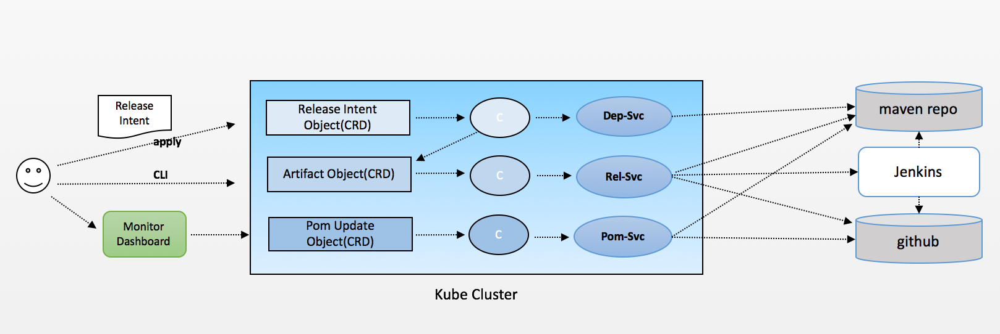

## Raptor.io Release Automation 

Simplify and visualize raptor.io release

---

### Why

- Release process is painful and boring: developers should focus on solving problems or features and test cases development
- Hard to know components release dependency
- Hard to track release artifact release status
- Hard to support fine grained releases

---

### Architecture




---
### Intent Objects
- RaptorIORelease: top level release object
- Artifact: each individual release object
- DependencyUpdate: object to sync with pom update service
- Controllers (operators)
  * release controller
  * artifact controller
  * pom dependency controller
---
### Release Dependency Service

- Calculate current release dependencies
- Input: release artifact and version
- Output: All artiafct releases and its dependencies
```
sample code here
```

---

### Release Service

- Dispatcher: Manages Data Flow
- Stores: Handle State & Logic
- Views: Render Data via React

---

### POM Service

- Dispatcher: Manages Data Flow
- Stores: Handle State & Logic
- Views: Render Data via React

---

### Demo
- Release monitor dashboard
- Command Line Query
- Test example demo

---

### Q/A
